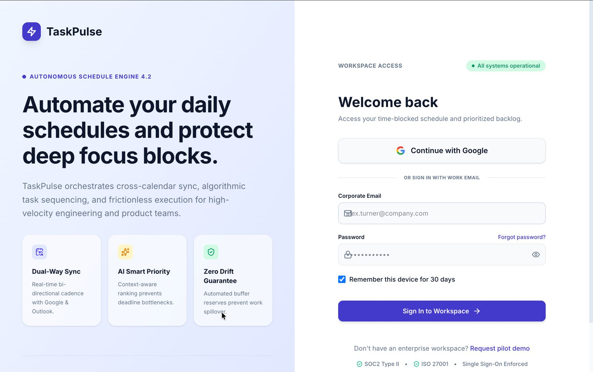
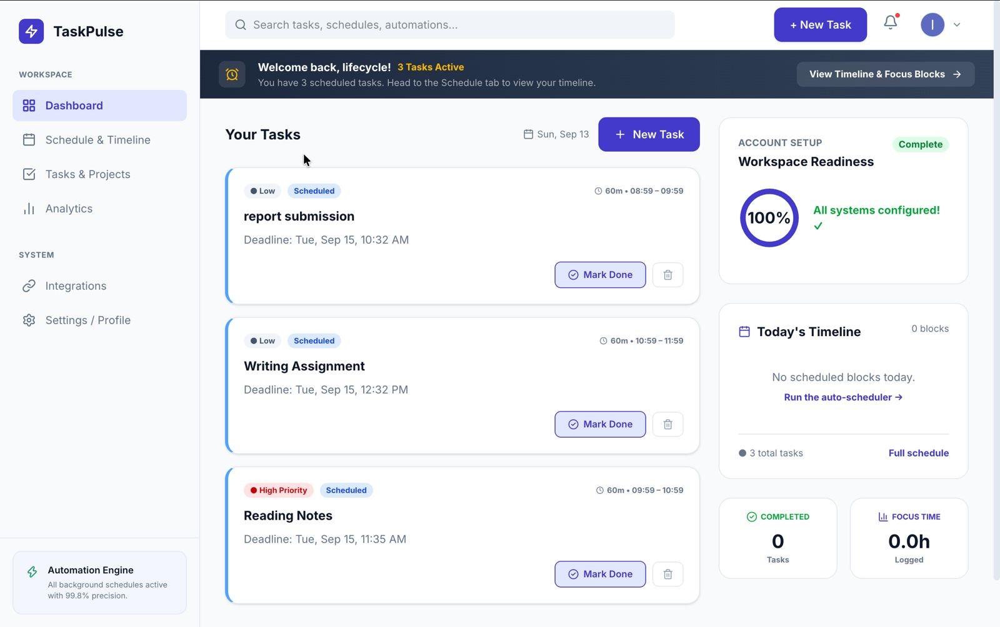
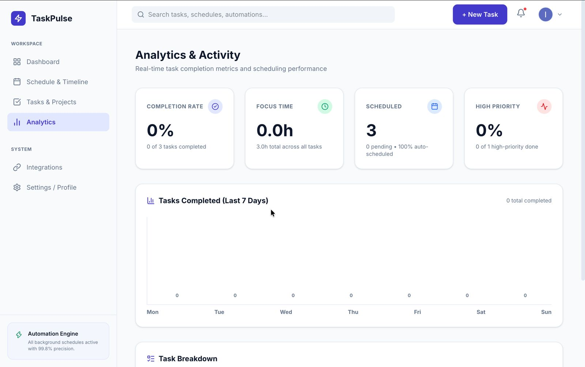
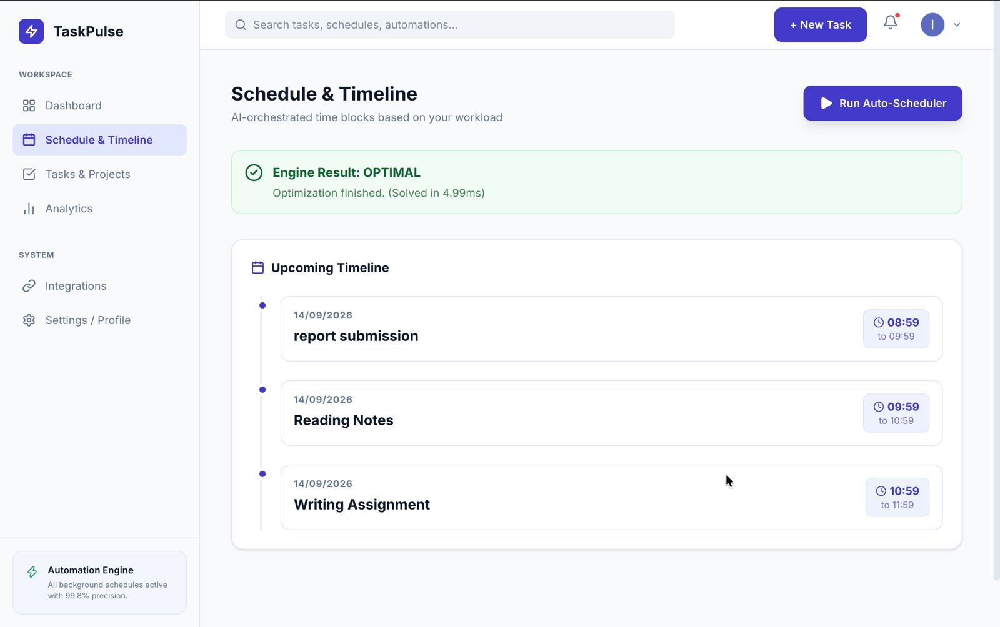
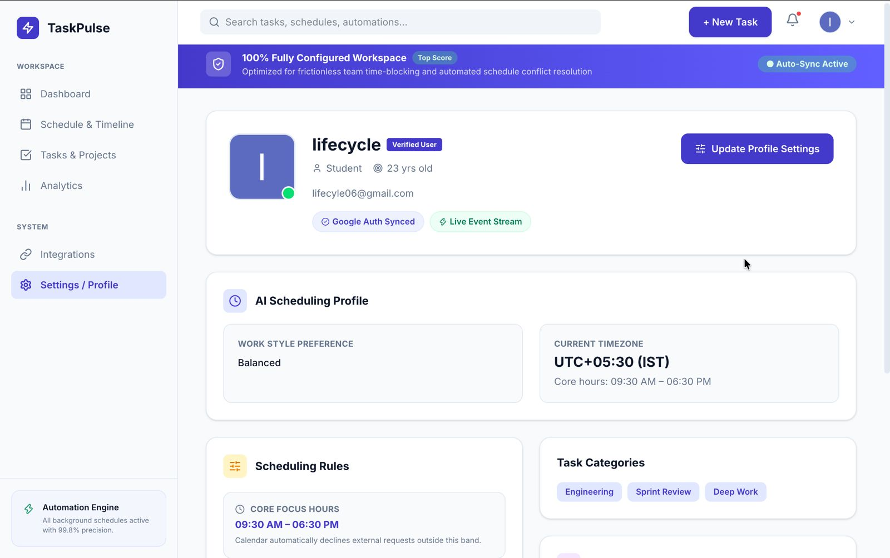
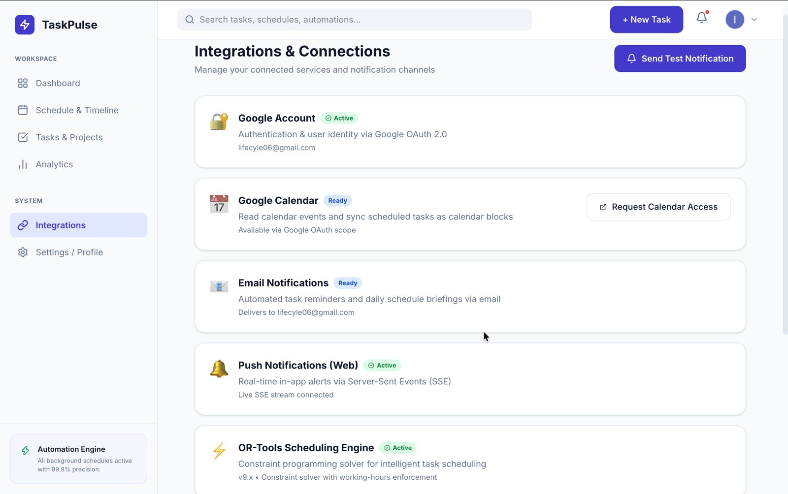

# 🚀 TaskPulse - AI-Based Smart Scheduling & Recommendation Engine

TaskPulse is an autonomous, context-aware smart scheduling system that transforms task management into intelligent, time-blocked productivity schedules. It combines Google OR-Tools CP-SAT constraint programming, circadian rhythm biometrics, real-time activity sensors, zero-dataset multi-criteria task recommendations, a 2-way ChatGPT-style Voice Mode Orb, ultra-realistic Neural TTS human speech synthesis, and multi-provider LLM routing.

---

## 🌟 Visual Showcase & Architecture

### 1. System Architecture & Context Loop

### 2. Task Management & IST Timeline Scheduling

### 3. CP-SAT Constraint Engine & Focus Windows

### 4. Activity Classification & Motion Sensor Loop

### 5. On-Device Sensor Inference Demo

### 6. Benchmark Performance & Optimization Metrics

---

## 💡 Key Features

### 1. 🎙️ 2-Way Voice Mode Orb Interface
- **3D Canvas Energy Visualizer**: Features a luminous 3D sphere rendered with over 2,400 glowing orbital energy particles in WebGL/Three.js, styled with electric cyan, violet, and indigo color fields.
- **Hands-Free 2-Way Voice Loop**: Talk naturally with hands-free speech recognition and instant neural AI voice playback.
- **Speech Interruption (Barge-In)**: Speaking at any point immediately interrupts ongoing AI speech playback and processes your new query without delay.
- **Master Kill Switch**: Closing the Voice Orb modal instantly terminates microphone speech recognition, active HTML5 audio streams, and Web Speech threads to guarantee zero background audio or listening.

---

### 2. 🗣️ Ultra-Realistic Neural Human Text-to-Speech (Edge-TTS)
- **Neural Human Speech Endpoint (`/nlp/tts`)**: Powered by Microsoft Edge Neural TTS voices (`en-US-AvaNeural`, `en-US-EmmaNeural`, `en-US-AndrewNeural`, etc.) delivering warm, studio-quality human voice responses.
- **Natural Voice Selection**: Supports multiple customizable AI voice models tailored for warm, professional, or deep vocal tones.
- **Smart Web Speech Fallback**: Automatically selects natural browser voices (`Ava`, `Samantha`, `Jenny`, `Google US English`) with pitch (`1.05`) and rate (`0.96`) tuning for smooth human cadence when offline.

---

### 3. 🤖 Context-Aware Multi-LLM Routing & Instant Failover Engine
- **Multi-Provider LLM Architecture**: Automatically routes queries between Google Gemini (`gemini-3.5-flash-lite`), Groq LLaMA (`openai/gpt-oss-120b`), and local Ollama (`gemma4:31b`).
- **Domain Boundary Scoping**: System prompt is strictly constrained to TaskPulse smart scheduling, task management, chronotype productivity, and workspace features, gracefully declining off-topic queries.
- **Sub-5ms Dynamic Rule Engine**: Local NLP rule fallback engine handles greetings, task creation, rescheduling requests, date/time queries, and system capabilities seamlessly with zero latency.
- **Smart Rate-Limit Cooldown**: Automatically detects HTTP 429 rate limits for 30s lockouts without triggering false long-term locks on parameter errors.

---

### 4. 🔔 Multi-Channel Alert & Haptic Notification System
TaskPulse provides 5 customizable notification modes under **Profile Settings**:

| Alert Preference | Web Push Popup | Sound Chime | AI Neural Voice | Device Haptic Vibration |
| :--- | :---: | :---: | :---: | :---: |
| **Web Push + Sound Chime (Default)** | ✅ | ✅ | ❌ No Voice | ✅ |
| **Notification Sound Chime Only** | ❌ | ✅ | ❌ No Voice | ❌ |
| **Vibration / Phone Haptic Only** | ✅ | ❌ | ❌ No Voice | ✅ Haptic Pulse |
| **Web Push + Neural AI Voice** | ✅ | ✅ | ✅ Reads Aloud | ✅ |
| **Silent / Visual Only** | ✅ | ❌ | ❌ No Voice | ❌ |

- **Ambient Glass-Chime Audio**: Replaces harsh single sine beeps with a soft C-major 7th chord triad exponential decay chime.
- **Device Vibration Support**: Triggers mobile/device haptic feedback (`navigator.vibrate`) for discrete silent alerts.

---

### 5. ⚡ Zero-Dataset Personalized AI Task Recommendation Engine
Computes real-time **"Next Best Task"** suggestions using a **Deterministic Multi-Criteria Utility Model**:

$$\text{Task Score} = \text{Base Priority Score} + \text{Circadian Energy Alignment} + \text{Role Affinity} - \text{Fatigue Penalty}$$

- Evaluates Morning Lark / Night Owl chronotypes, wake/sleep biometrics, and focus duration limits.
- Matches high-cognition tasks (*Coding, Architecture*) to **Peak Focus Slots** and routine tasks (*Emails, Admin*) to **Post-Lunch Energy Dips**.

---

### 6. 🔒 Dual Task Creation Modes & CP-SAT Solver Integration
- **🤖 AI Flexible Task**: Autonomous Google OR-Tools CP-SAT solver dynamically assigns non-overlapping time blocks before deadlines.
- **🔒 Fixed Event / Meeting**: Hard-locked to exact start times, protected from rescheduling.
- **🌙 Dynamic Quiet / Sleep Hours**: Enforces hard quiet/rest constraints outside core active working hours (`workEnd` to `workStart`).
- **⏰ Strict IST Wall-Clock Standardization**: All timestamps across FastAPI, MongoDB Atlas BSON, and React UI are strictly normalized to **Asia/Kolkata (UTC+05:30)**.

---

### 7. 📱 Sensor-Based Real-Time Activity Detection
- Mobile motion sensor data (accelerometer + gyroscope) passed to browser ONNX runtime to classify user state (walking, sitting, driving) and trigger autonomous schedule updates (`/auto-shift`).

---

## 🛠 Tech Stack

- **Backend**: Python 3.13 / 3.14, FastAPI, Edge-TTS (Neural Human Voice), Google Gemini / Groq / Ollama LLMs, OR-Tools (CP-SAT Solver), Motor / PyMongo, PyJWT, Pydantic.
- **Frontend**: React, Vite, Three.js / WebGL (Voice Orb 3D Engine), Lucide Icons, Vanilla CSS Design System.
- **Machine Learning & Sensors**: ONNX Runtime Web, Random Forest Activity Classifier.

---

## 🚦 Getting Started & Environment Setup

TaskPulse consists of a Python/FastAPI backend and a React/Vite frontend. Each component has its own dedicated `.env` configuration and setup process.

For complete, step-by-step installation instructions and environment variable templates, please refer to the dedicated setup guides:

- 🔗 [Backend Setup & Environment Variables](./backend/README.md)
- 🔗 [Frontend Setup & Environment Variables](./frontend/README.md)
