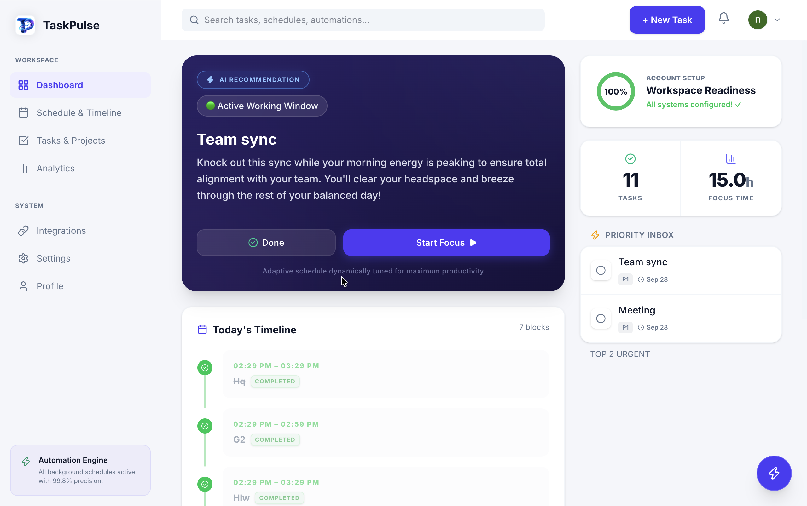
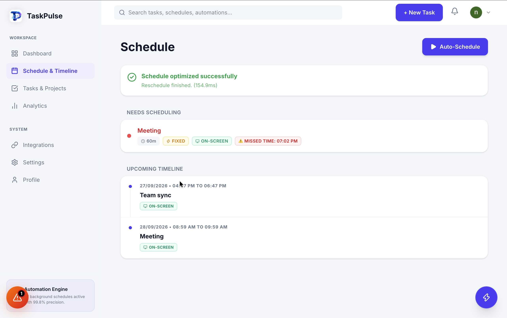
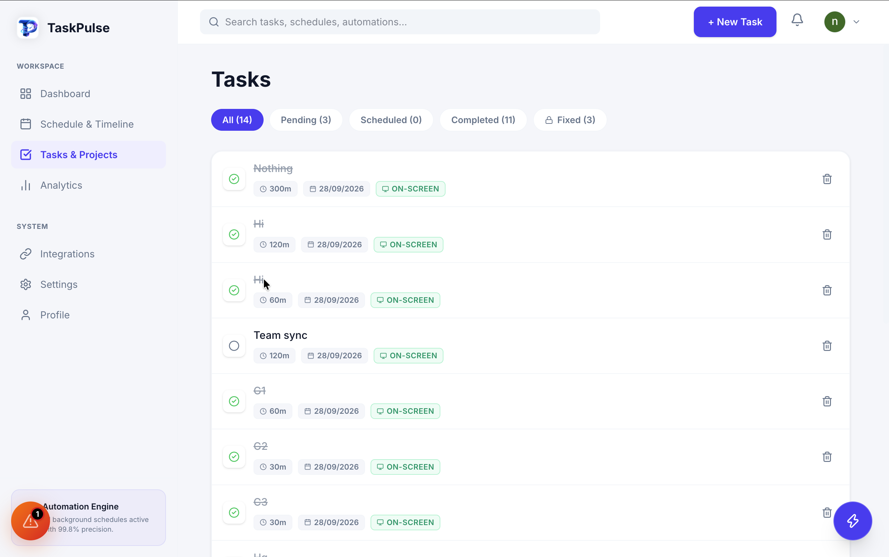
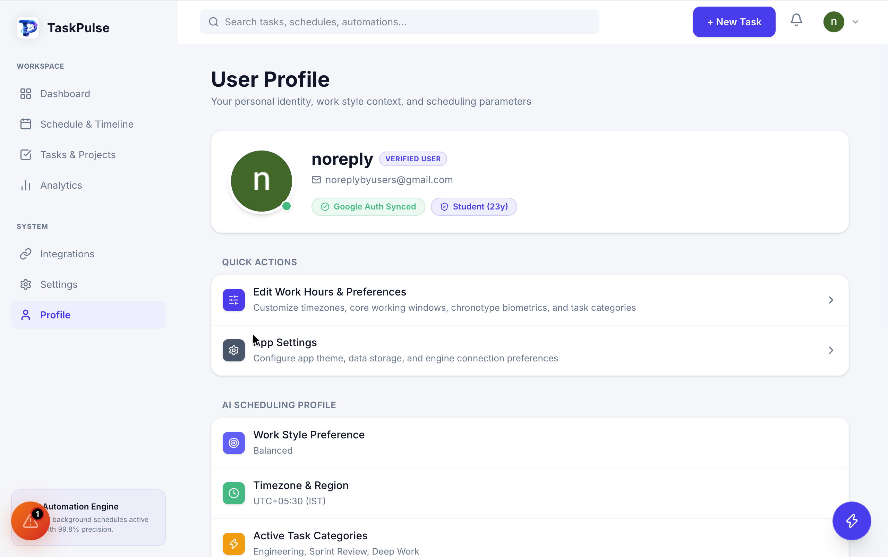
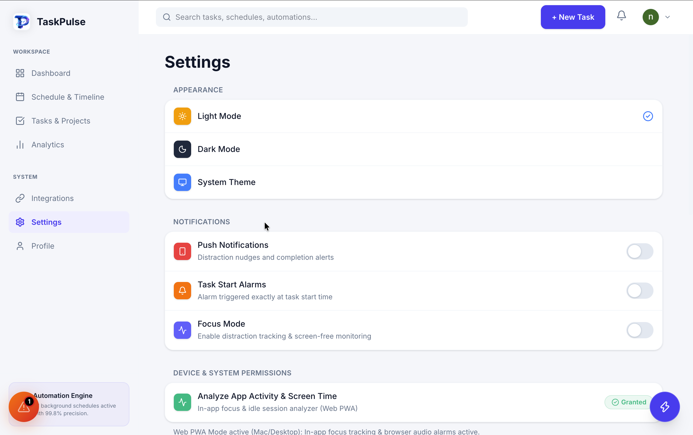

# TaskPulse 🌳

TaskPulse is an intelligent, autonomous scheduling assistant designed to eliminate decision fatigue and enforce deep work through gamification and AI-driven automation.

## 🚨 The Problem
Modern professionals suffer from **decision fatigue**, constant **context switching**, and the chaos of manually managing overflowing calendars. When a single deadline is missed or a meeting runs late, the entire day's schedule breaks, forcing users to manually drag and drop tasks, leading to anxiety and lost productivity.

## 💡 The Solution
TaskPulse acts as your personal, ruthless time manager. It doesn't just list tasks; it **orchestrates your day**. By combining advanced constraint programming (CP-SAT) with Bio-Rhythm AI, TaskPulse auto-sequences your work. When life happens, it automatically recalculates your schedule. To ensure you actually do the work, it immerses you in a gamified, nature-themed "Smart Focus Mode" where your productivity grows a digital 3D tree.

## ✨ Core Features

*   **Gamified iFocus 3D Environment (Smart Focus Mode):** Enter a dedicated deep-work state where a digital "Tree of Productivity" grows organically. Break focus, and the tree suffers. Maintain unbroken, screen-free focus, and watch your forest thrive.
*   **AutoShift Engine:** Missed a deadline? No problem. Our powerful CP-SAT solver instantly re-routes and recalculates your entire schedule without requiring any manual drag-and-drop.
*   **Bio-Rhythm AI:** Personalized NLP-driven recommendations map heavy, analytical tasks perfectly to your personal cognitive peak energy windows.
*   **Aggressive Native Alarms (Smart Focus Alerts):** Bypasses standard web notification limitations. Deep Android integration fires real-time, unmissable wakeup alarms directly on your device when a critical task begins.
*   **Zero-Drift Calendar Sync:** Real-time, bi-directional sync with your Google Calendar ensures you are never double-booked and buffer times are automatically protected.

## 🏗️ The Way We Are Building

We are building TaskPulse with a **Premium, Mobile-First Native Strategy**:
1.  **Nature-Inspired Premium UI:** A cohesive, earthy, emerald-green design language utilizing glassmorphism and fluid micro-animations to create a calming yet focused user experience.
2.  **Hybrid Native Architecture:** Built as an ultra-fast web application that is compiled directly into a native Android APK using Capacitor. This gives us the rapid iteration speed of the web with the raw power of native device APIs (like background alarm receivers).
3.  **Heavy Backend Lifting:** Complex schedule calculations and NLP processing are offloaded to a robust Python backend, keeping the client lightweight and snappy.

## 💻 Technology Stack

*   **Frontend:** React 18, Vite, Tailwind CSS (Custom Flora/Nature Theme), React Router, Lucide Icons, Three.js (for 3D tree gamification).
*   **Mobile / Native Bridge:** Capacitor JS (Native Android build, Google Auth Plugin, Background Services, AlarmManager).
*   **Backend:** Python, FastAPI, Google OR-Tools (CP-SAT Solver), Natural Language Processing (NLP) chains.
*   **Authentication:** Google OAuth 2.0 (Web + Native Capacitor flow).

## 🖼️ Application Overview

Here is a look at TaskPulse in action:

